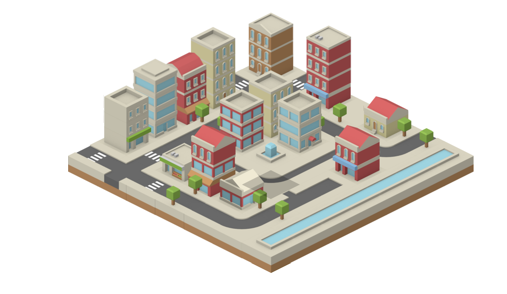

# 🌆 IsoCity

An isometric city builder in JavaScript🏗️

## 🛠️ About
IsoCity is a simple JavaScript city builder that allows you to create your very own tiny city! There are no simulations, budgets, or specific goals—just pure creative freedom. While the game can technically be played on a mobile device, it wasn't specifically designed with mobile optimization in mind.

## Texture Credits

Textures from - [http://www.kenney.nl](https://opengameart.org/users/kenney)
Check out their amazing work for game assets! 🌟

## 🎨 Texture Credits

Textures used in IsoCity are courtesy of [Kenney](http://www.kenney.nl). 

## 🚀 Features

- **Isometric View**: Experience a unique isometric perspective while building your city.
- **Intuitive Controls**: Easy-to-use interface that allows for seamless construction of buildings.
- **No Limits**: Build freely without restrictions, goals, or budgets.
- **Simple and Engaging**: Perfect for casual gamers and city-building enthusiasts alike.

## 📦 Installation

To run IsoCity locally, clone the repository and open the `index.html` file in your preferred web browser.

git clone https://github.com/gidi007/isocity-master.git
cd isocity
open index.html

## 🎮 Usage
Once you have the project open in your browser, use the controls to start building your city! Click to place buildings and unleash your creativity.

## 🤝 Contributing
If you would like to contribute to IsoCity, please fork the repository and submit a pull request. Your contributions are welcome!

Created with ❤️ by Gideon Bawa